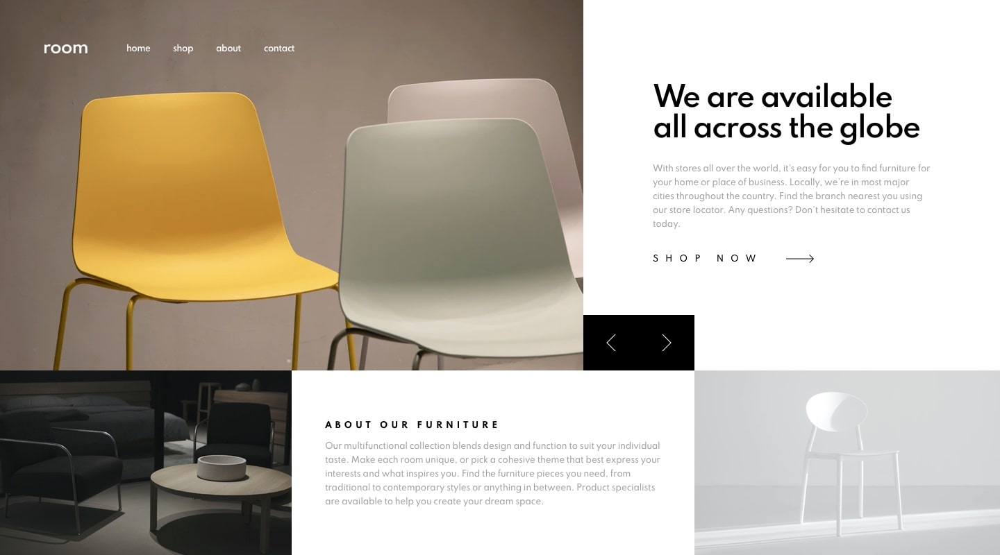
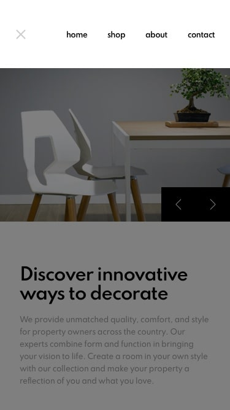

# room-homepage

# Front-end Style Guide

## Layout

The designs were created to the following widths:

- Mobile: 375px
- Desktop: 1440px

# Design screenshots

# Active-states

# Desktop-design-slide-1

# Desktop-design-slide-2

# Desktop-design-slide-3

# Desktop-preview

# Mobile-design

# Mobile-navigation

## Colors

### Primary

- Dark Gray: hsl(0, 0%, 63%)
- Black: hsl(0, 0%, 0%)
- White: hsl(0, 0%, 100%)
- Very Dark Gray: hsl(0, 0%, 27%)

## Typography

### Body Copy

- Font size: 12px

### Font

- Family: [Spartan](https://fonts.google.com/specimen/Spartan)
- Weights: 500, 600, 700
